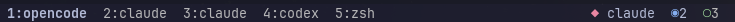
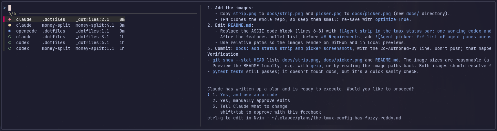

# tmux-agentic-plugin

See at a glance what your coding agents are doing across every tmux session,
and jump straight to the one that needs you.



It detects Claude Code, Codex, OpenCode, Gemini, Aider, Amp, Copilot and other
agent CLIs running in any pane, and tracks each one's state:

| Mark | State   | Meaning                                 |
|------|---------|-----------------------------------------|
| ◆    | blocked | needs input or approval (red)           |
| ●    | working | actively running (yellow)               |
| ◉    | ready   | finished, you have not looked yet (blue)|
| ○    | idle    | finished and seen (green, name dimmed)  |

- **Status bar strip**: one `mark name` per agent, most urgent first. Past
  four agents it switches to counts per state (`◆ codex  ●5  ○3`), and keeps
  blocked agents named while there are at most two.
- **Picker** (`prefix + a`): an fzf popup over every agent pane with a live
  preview. Enter switches to that pane, in any session.
- **Jump** (`prefix + A`): straight to the next blocked agent, then to
  finished ones you have not looked at. Press again to cycle through them.
- **Desktop notifications** when an agent you are not looking at gets
  blocked or finishes. Click one to jump to that pane, with its terminal
  window raised on its workspace.
- **Exact states through agent hooks** (optional): Claude Code, Codex and
  OpenCode report their own lifecycle. Without hooks, state is inferred
  from pane output and CPU use.



## Requirements

- tmux 3.2+ (`display-popup`)
- bash 4+ (on macOS: `brew install bash`)
- [fzf](https://github.com/junegunn/fzf) for the picker
- jq for `install-hooks` and `status --json`
- Linux or macOS. Notifications use `notify-send` or `osascript`; clicking
  them works with `notify-send` (see [Clicking notifications](#clicking-notifications)).

## Install

### With [TPM](https://github.com/tmux-plugins/tpm)

```tmux
set -g @plugin 'Abstrucked/tmux-agentic-plugin'
set -g status-right '#{agent_status} %H:%M'   # where the strip goes
set -g focus-events on                        # lets focusing a pane mark it seen
```

Then press `prefix + I`.

### Manually

```sh
git clone https://github.com/Abstrucked/tmux-agentic-plugin ~/.tmux/plugins/tmux-agentic-plugin
```

```tmux
run-shell ~/.tmux/plugins/tmux-agentic-plugin/tmux-agentic.tmux
```

### Agent hooks (recommended)

Hooks make states exact, not inferred. Run this once, and again if you move
the plugin:

```sh
~/.tmux/plugins/tmux-agentic-plugin/bin/tmux-agent install-hooks            # all three
~/.tmux/plugins/tmux-agentic-plugin/bin/tmux-agent install-hooks claude     # or pick
```

| Agent       | What it changes                                                   |
|-------------|-------------------------------------------------------------------|
| Claude Code | merges hook entries into `~/.claude/settings.json`                |
| Codex       | merges hook entries into `~/.codex/hooks.json`; needs `hooks = true` under `[features]` in `~/.codex/config.toml` |
| OpenCode    | links `~/.config/opencode/plugins/tmux-agent` to this plugin      |

Re-running replaces earlier tmux-agent entries and leaves your other hooks
alone. `install-hooks --remove` takes them out again.

TPM installs to `~/.config/tmux/plugins/` instead of `~/.tmux/plugins/` when
your config lives in `~/.config/tmux`. Adjust the paths above to match.

### Clicking notifications

Clicking a notification switches a tmux client to that agent's session,
window and pane, then raises the terminal window the client runs in,
switching to its workspace or tag. Nothing to set up on most desktops.

The click needs a notification daemon that runs the default action on click
and libnotify 0.7.9+ (`notify-send --wait`). swaync, mako, awesome, GNOME and
KDE do out of the box. dunst closes the notification on a left click by
default; add this to `dunstrc`:

```ini
[global]
    mouse_left_click = do_action, close_current
```

Raising the window is detected from the tmux client's environment:

| Desktop                                  | How                                                          |
|------------------------------------------|--------------------------------------------------------------|
| Hyprland                                 | `hyprctl` (Lua configs through `eval`, older ones `dispatch`); needs jq |
| sway                                     | `swaymsg [pid=…] focus`                                      |
| awesome                                  | `awesome-client`, jumping to the client's tag                |
| other X11 window managers (i3, bspwm, xfwm, KDE/GNOME on X11) | `xdotool`, else `wmctrl`, whichever is installed |
| GNOME/KDE on Wayland, macOS              | not raised; the tmux jump still happens                      |

For anything else, set `@tmux-agent-raise-command` to your own command. It
gets the tmux client's PID as its last argument; the terminal owning the
window is one of its ancestors.

## Options

| Option                        | Default       | Effect |
|-------------------------------|---------------|--------|
| `@tmux-agent-key`             | `a`           | picker key after the prefix; `off` for none |
| `@tmux-agent-urgent-key`      | `A`           | jump key after the prefix; `off` for none |
| `@tmux-agent-popup-size`      | `80%`         | picker popup width and height |
| `@tmux-agent-strip-position`  | `interpolate` | `interpolate`: replace `#{agent_status}` in `status-left`/`status-right`; `centre`: put the strip in the middle of the status bar; `off`: no strip |
| `@tmux-agent-strip-max`       | `4`           | agents shown by name before switching to counts |
| `@tmux-agent-notify`          | `on`          | desktop notifications; `off` to silence |
| `@tmux-agent-raise-command`   | detected      | raises the terminal window when a notification is clicked; a command (gets the client PID) or `off` |

Set options before the `@plugin` line runs, that is, above TPM's `run` line.

## CLI

`bin/tmux-agent` is also usable on its own:

```
tmux-agent status [--json]     list agent panes and states
tmux-agent attach --next       jump to the most urgent agent pane
tmux-agent attach --urgent [--from %3]   next blocked/ready pane, after %3
tmux-agent focus --pane %3     switch a client to %3 and raise its terminal
tmux-agent wait --pane %3 --state ready [--timeout 600]
tmux-agent window-dot @1       rollup state dot, for window-status-format
tmux-agent pane-label %3       agent + state, for pane-border-format
```

Run `tmux-agent` with no arguments for the full list.

## Uninstall

1. `bin/tmux-agent install-hooks --remove`, if you installed hooks.
2. Remove the `@plugin` line and `#{agent_status}`, then press
   `prefix + alt + u` (TPM clean).

## Development

```sh
shellcheck bin/tmux-agent lib/engine.sh lib/install-hooks tmux-agentic.tmux
pytest tests
```

## License

MIT
